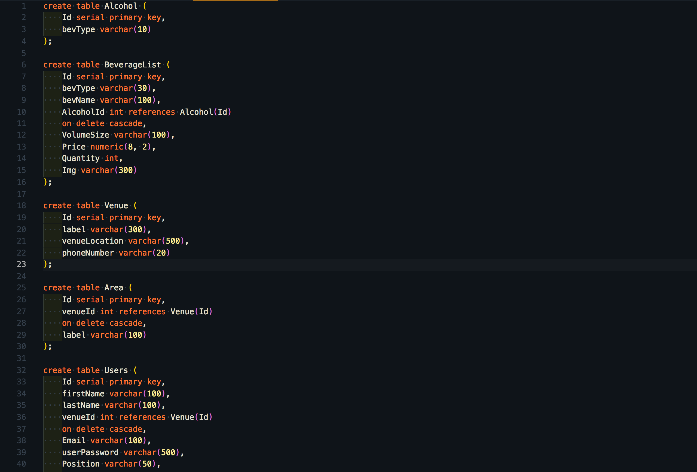
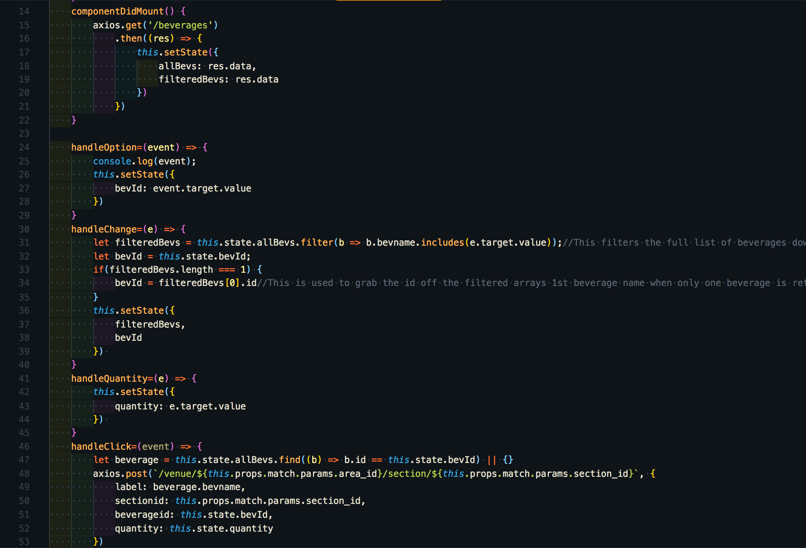

# BevSimply

## <a href="http://bevsimply.com/"> Live Demo <a>

## Overview

BevSimply is where business owners and entrepreneurs go to make beverage inventory a breeze! Simply login to the app, and add areas, sections, and beverages for your business. With a few clicks your inventory is done giving you the option to view the most recent data. BevSimply, where all your vendor management needs are met. 

## About

Create your own custom areas & sections uniquely tailoring to your business layout. Add different drinks to each section within an area to make inventory a breeze! Simply update your quantity/amount and click save. Then, see your updated inventory on the reporting page

Our mission is to help new and experienced vendors/business owners - make inventory reporting quick and painless freeing you up to manage all other business needs. Time is a precious commodity and one that we value at BevSimply. Sign-up with us today and leave the hard stuff to us!

## Built By
### <a href="https://github.com/rbrook22"> Rick Brooks </a>

<b>Contributions</b>

Styling | PostgreSQL Database Management | Querying User Preferences | AWS Deployment/Management | README.md |Trello Project Tracker | Walkthrough Video | Express Routing | UI/UX Design | React Components

### <a href="https://github.com/matthewfreeman821"> Matthew Freeman </a>

<b>Contributions</b>

PostgreSQL Database Management | Querying User Preferences | React Components

### <a href="https://github.com/Bhisma13"> Bhisma Bakhai </a>

<b>Contributions</b>

Styling

## Technologies Used
* React
* HTML5
* CSS3
* Bootstrap
* JavaScript / JSX
* API: Google Places
* Node.js
* Express
* Axios
* PostgreSQL
* Postico
* Postman
* VS LiveShare

## Project Planning

## Minimum Viable Product

User story: User lands on the homepage with the option to either login or sign-up. Once logged in the user goes straight to their dashboard where they can see a current list of inventory in stock. User will have the option to add areas, sections within areas, and adding beverages within a section. This makes it totally customizable to each venue and their needs.  

Adding a beverage: After a user creates both an area and a section it's time to add beverages to your section. Again making it unique to your setup and adding beverages from left to right. Once added you can simply click to udpate your inventory.

## Obstacles & Breakthroughs

Obstacle - Initially our plan was to use MongoDb for our database and Strapi api builder, however we quickly realised the inadequacies that it would present. Given the fact that we had so many relational tables that would be in the database it wouldn't support the functionality needed. Using Strapi came out to be more work than it was for the return effort and we ran in to compiled errors and weren't able to utilize it efficiently.

Breakthrough - Despite the initial hurdles we quickly recovered and decided to use postgreSQL since it works well with relational tables and would be adequate in supporting all functional needs for the app. Since we went this route we also decided to build out our API using express to handle everything needed.

Obstacle - Probably the biggest struggle we had with the development of BevSimply was regarding the components of venue, area, & section. Not only with figuring out unique routing on the backend but also doing all of the axios calls/post and making sure we were pulling all information unique to that area.

Breakthrough - Once we restructered a few things in our database and had a plan of how this should look the rest was just writing the code. Ultimately we wrote several helper functions to make sure we were posting and getting the right data for the specific area id. From there it was adding some delete functions to let the user truly customer their venue & dashboard to their needs.

## Phase 2 Features

 Currently our application only allows for one user to be tied to one specific venue. In the future, we will be adding a feature so users can register multiple venues and are able to check in and update inventory for each venue. Perfect for franchises or multiple locations for business owners. 

We will also be implementing a slider functionality to make running inventory even easier. Taking into account when the user drops the slider down it does the math for you and add its remaining volume size to your reporting page. Currently our reporting page only shows the most recent and up to date reporting that has been ran. In the near future we will be adding so that you can see which user ran the report & when along with all previously ran inventory reports for the past X time.

We will aslso be adding unique images for each beverage added, making it simple to determine which bottle you are doing inventory on.

